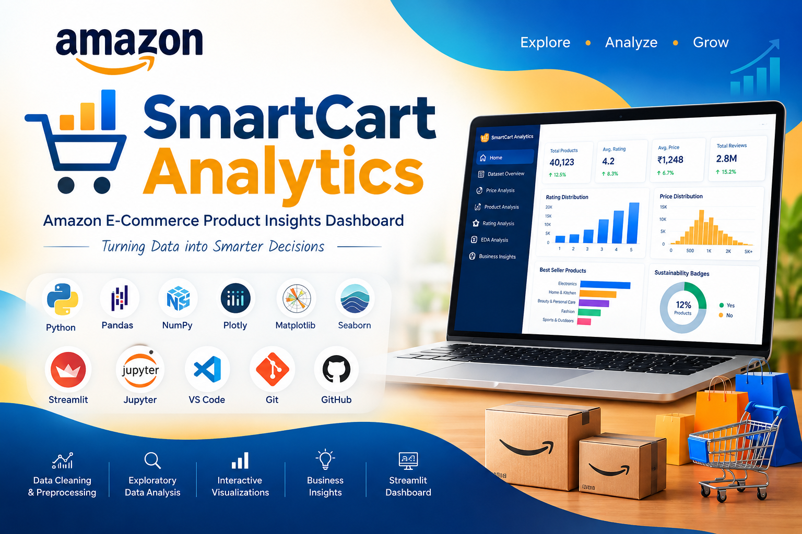
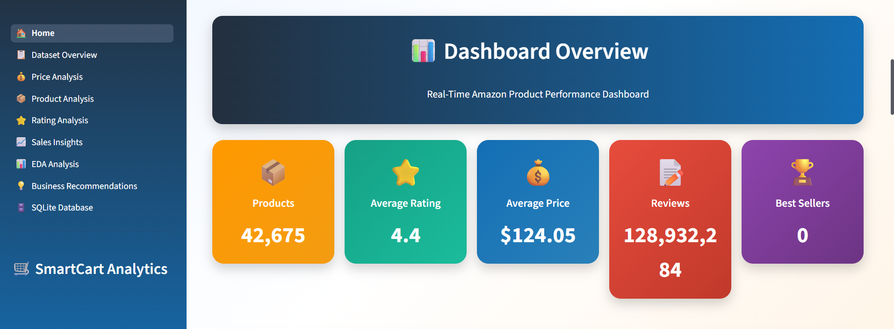
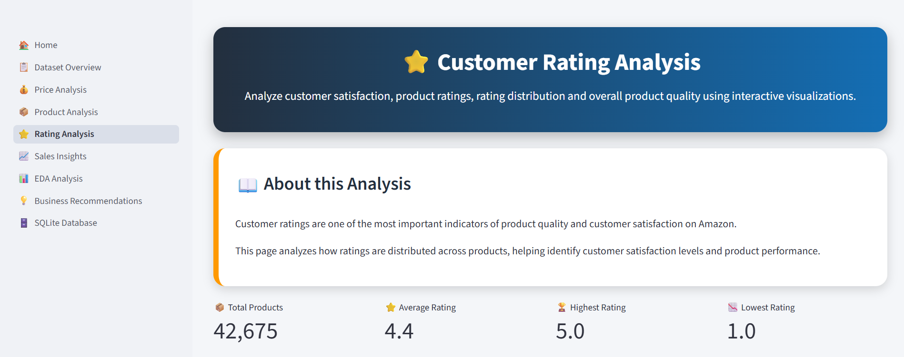
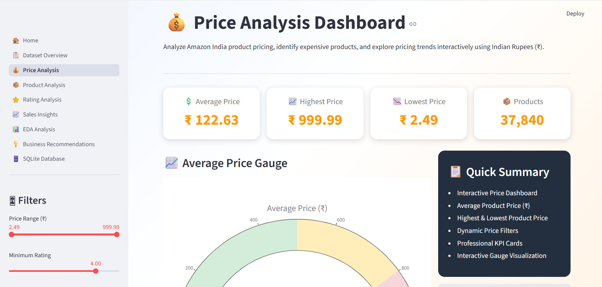
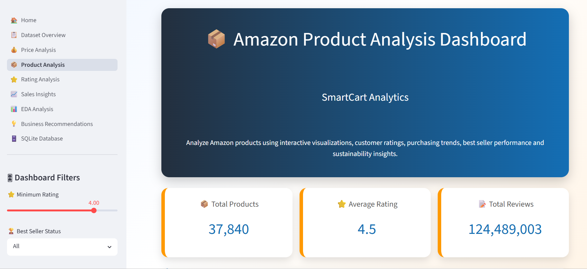
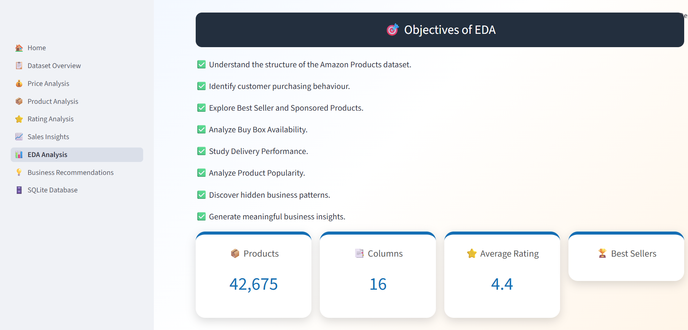

<!-- ========================================================= -->
<!--                  SMARTCART ANALYTICS                      -->
<!-- ========================================================= -->


</div>

<div align="center">

[](https://git.io/typing-svg)

</div>

---

<div align="center">

# 🛒 SmartCart Analytics

### 📊 Amazon E-Commerce Product Insights Dashboard

### 🚀 Transforming Raw Product Data into Interactive Business Insights

</div>

---

<div align="center">


</div>

---

# 📖 Project Overview

**SmartCart Analytics** is a complete **Data Science and Business Analytics** project developed using **Python** and **Streamlit**.

The project analyzes **Amazon product data** to discover meaningful business insights from product ratings, customer reviews, prices, discounts, sustainability badges, delivery information, Best Seller status, and customer purchasing trends.

This project demonstrates the complete Data Science lifecycle—from raw data cleaning to interactive dashboard development.

---

# 🌟 Project Highlights

✅ Data Cleaning

✅ Data Preprocessing

✅ Missing Value Treatment

✅ Outlier Detection

✅ Exploratory Data Analysis (EDA)

✅ Interactive Plotly Visualizations

✅ Business Insights

✅ Interactive Streamlit Dashboard

✅ Professional Documentation

---

# 📑 Table of Contents

- 📖 Project Overview
- 🎯 Project Objectives
- 📚 Dataset Information
- 💻 Technology Stack
- 📂 Project Structure
- ⚙ Installation Guide
- 🚀 Running the Dashboard
- 📊 Data Cleaning Workflow
- 📈 Exploratory Data Analysis
- 📊 Dashboard Features
- 📸 Dashboard Preview
- 💡 Business Insights
- 🔮 Future Scope
- 👩‍💻 Author
- ⭐ Support

---

# 🎯 Project Objectives

✔ Analyze Amazon Product Dataset

✔ Understand Customer Rating Behaviour

✔ Analyze Product Reviews

✔ Compare Listed Price vs Discounted Price

✔ Study Best Seller Products

✔ Analyze Coupon Availability

✔ Explore Sustainability Badges

✔ Understand Delivery Information

✔ Build Interactive Dashboard

✔ Generate Business Insights

---

# 📚 Dataset Information

| Feature | Details |
|---------|---------|
| 📦 Dataset | Amazon Products Dataset |
| 📄 Records | 40,000+ Products |
| 📊 Features | 16 Columns |
| 🧹 Data Cleaning | Completed |
| 📈 Visualizations | Plotly + Seaborn + Matplotlib |
| 📊 Dashboard | Streamlit |

---

# 🖼 Project Banner

<p align="center">



</p>

---

# 📸 Dashboard Preview

> 📌 Replace these images after completing your Streamlit dashboard.

| Home Dashboard | Rating Analysis |
|----------------|-----------------|
|  |  |

| Price Analysis | Product Insights |
|----------------|------------------|
|  |  |

---

# 💻 Technology Stack

<div align="center">

| Category | Technologies |
|-----------|--------------|
| 👨‍💻 Programming | Python |
| 📊 Data Analysis | Pandas, NumPy |
| 📈 Visualization | Plotly, Matplotlib, Seaborn |
| 🎨 Dashboard | Streamlit |
| 📓 Development | Jupyter Notebook |
| 💻 IDE | VS Code |
| 🔄 Version Control | Git & GitHub |

</div>

---

# 🛠 Tools & Libraries

<div align="center">

| Python | Pandas | NumPy | Plotly |
|:--:|:--:|:--:|:--:|
|  |  |  |  |

| Streamlit | VS Code | Git | GitHub |
|:--:|:--:|:--:|:--:|
|  |  |  |  |

</div>

---

# 📂 Project Structure

```text
SmartCart_Analytics/

│

├── app.py

├── README.md

├── requirements.txt

│

├── data/

│ ├── amazon_products_sales_data_uncleaned.csv

│ └── amazon_products_sales_data_cleaned.csv

│

├── notebooks/

│ └── smartcart_analytics.ipynb

│

├── pages/

│ ├── Home.py

│ ├── Dashboard.py

│ ├── Rating_Analysis.py

│ ├── Price_Analysis.py

│ ├── Product_Insights.py

│ └── About.py

│

├── graphs/

├── reports/

├── assets/

│ ├── banner.png

│ ├── logo.png

│ └── dashboard_preview.png

│

└── screenshots/
```

---

# ⚙ Installation Guide

### Clone Repository

```bash
git clone https://github.com/YourUsername/SmartCart-Analytics.git
```

---

### Move into Project Folder

```bash
cd SmartCart-Analytics
```

---

### Install Required Libraries

```bash
pip install -r requirements.txt
```

---

# 📦 Required Libraries

```text
streamlit
pandas
numpy
plotly
matplotlib
seaborn
Pillow
```

---

# 🚀 Run Streamlit Dashboard

```bash
streamlit run app.py
```

After running the above command, Streamlit will automatically launch the interactive dashboard in your browser.

---

# 🔄 Complete Project Workflow

```text
Amazon Dataset

        │

        ▼

Data Collection

        │

        ▼

Data Cleaning

        │

        ▼

Missing Value Treatment

        │

        ▼

Outlier Detection

        │

        ▼

Exploratory Data Analysis

        │

        ▼

Business Insights

        │

        ▼

Interactive Streamlit Dashboard

        │

        ▼

Final Report & Presentation
```

---

# 📊 Dashboard Modules

✔ Home Dashboard

✔ KPI Cards

✔ Rating Analysis

✔ Review Analysis

✔ Price Analysis

✔ Product Insights

✔ Sustainability Analysis

✔ Delivery Analysis

✔ Correlation Analysis

✔ Business Insights

✔ Download Clean Dataset

---
---

# 📊 Exploratory Data Analysis (EDA)

The dataset was explored using multiple visualization libraries to discover hidden patterns, identify customer behavior, and generate meaningful business insights.

## 📈 Visualizations Used

| Analysis | Chart Type | Library |
|-----------|------------|---------|
| ⭐ Rating Distribution | Histogram | Plotly |
| 💰 Price Distribution | Histogram | Plotly |
| 💬 Review Distribution | Box Plot | Plotly |
| ⭐ Rating vs Reviews | Scatter Plot | Plotly |
| 🏆 Best Seller Analysis | Bar Chart | Plotly |
| 🌱 Sustainability Analysis | Donut Chart | Plotly |
| 🛒 Buy Box Availability | Pie Chart | Plotly |
| 🚚 Delivery Analysis | Treemap | Plotly |
| 🔥 Correlation Analysis | Heatmap | Seaborn |

---

# 📊 Dashboard Preview

> Replace these images after completing your Streamlit Dashboard.

<p align="center">


</p>
---

# ✨ Dashboard Features

✔ Interactive KPI Cards

✔ Dynamic Filters

✔ Rating Analysis

✔ Review Analysis

✔ Product Price Insights

✔ Best Seller Detection

✔ Sustainability Badge Analysis

✔ Buy Box Analysis

✔ Delivery Insights

✔ Correlation Heatmap

✔ Download Clean Dataset

✔ Responsive Layout

✔ Plotly Interactive Charts

---

# 📊 Key Business Insights

### ⭐ Customer Ratings

- Most products receive ratings above **4.0**, indicating high customer satisfaction.
- Highly rated products generally have better customer engagement.

---

### 💬 Customer Reviews

- A small number of products account for a very large share of reviews.
- Popular products generate significantly higher customer interaction.

---

### 💰 Pricing

- Product prices vary widely across Amazon listings.
- Premium products coexist with budget-friendly options.

---

### 🏆 Best Seller Analysis

- Only a limited number of products receive the **Best Seller** badge.
- Most products belong to the standard listing category.

---

### 🌱 Sustainability

- Sustainability badges appear on only a fraction of products.
- This highlights opportunities for eco-friendly product promotion.

---

### 🚚 Delivery

- Fast delivery options are available for many products.
- Delivery information helps customers make purchase decisions.

---

### 🔥 Correlation Analysis

- Relationships among numerical variables help identify trends.
- Correlation analysis supports data-driven business decisions.

---

# 📸 EDA Preview

<p align="center">



</p>

---

# 📚 Dataset Information

| Feature | Details |
|----------|----------|
| Dataset | Amazon Products Sales Dataset |
| Records | 48,000+ Products |
| Source | Amazon Product Listings |
| Data Type | Structured CSV |
| Cleaning | Missing Value Treatment, Formatting, Feature Engineering |
| Visualization | Plotly, Seaborn, Matplotlib |
| Dashboard | Streamlit |

---
---

# 🚀 Installation Guide

## 1️⃣ Clone the Repository

```bash
git clone https://github.com/YOUR_USERNAME/SmartCart-Analytics.git
```

---

## 2️⃣ Move into the Project Folder

```bash
cd SmartCart-Analytics
```

---

## 3️⃣ Create Virtual Environment (Recommended)

### Windows

```bash
python -m venv venv
venv\Scripts\activate
```

### Mac/Linux

```bash
python3 -m venv venv
source venv/bin/activate
```

---

## 4️⃣ Install Required Libraries

```bash
pip install -r requirements.txt
```

---

## 5️⃣ Run Streamlit Dashboard

```bash
streamlit run dashboard/app.py
```

---

# 📂 Project Workflow

```text
                  Amazon Dataset
                        │
                        ▼
              Data Cleaning (Pandas)
                        │
                        ▼
            Missing Value Imputation
                        │
                        ▼
             Exploratory Data Analysis
                        │
                        ▼
            Business Insight Generation
                        │
                        ▼
          Interactive Plotly Visualizations
                        │
                        ▼
           Streamlit Dashboard Development
                        │
                        ▼
               Final Business Dashboard
```

---

# 🏗 Project Architecture

```text
                 +-----------------------+
                 | Amazon Product Dataset|
                 +-----------+-----------+
                             |
                             |
                             ▼
                 +-----------------------+
                 | Data Cleaning (Pandas)|
                 +-----------+-----------+
                             |
                             ▼
                 +-----------------------+
                 | Exploratory Analysis  |
                 +-----------+-----------+
                             |
               +-------------+--------------+
               |                            |
               ▼                            ▼
     Plotly Interactive             Seaborn Analysis
      Visualizations                 Correlation
               |                            |
               +-------------+--------------+
                             |
                             ▼
                  Streamlit Dashboard
                             |
                             ▼
                 Business Decision Making
```

---

# 📁 Complete Project Structure

```text
SmartCart-Analytics/
│
├── assets/
│   ├── banner.png
│   ├── amazon_logo.png
│   ├── dashboard_home.png
│   ├── dashboard_analysis.png
│   ├── workflow.png
│   └── architecture.png
│
├── cleaned_data/
│   └── amazon_products_sales_data_cleaned.csv
│
├── dashboard/
│   ├── app.py
│   ├── utils.py
│   └── style.css
│
├── data/
│   └── amazon_products_sales_data_uncleaned.csv
│
├── graphs/
│   ├── rating_distribution.png
│   ├── review_distribution.png
│   ├── best_seller.png
│   ├── sustainability.png
│   └── heatmap.png
│
├── notebooks/
│   └── smartcart_analytics.ipynb
│
├── pages/
│   ├── Home.py
│   ├── Product Analysis.py
│   ├── Rating Analysis.py
│   ├── Sustainability.py
│   ├── Buy Box.py
│   └── About.py
│
├── reports/
│   └── Project_Report.pdf
│
├── requirements.txt
└── README.md
```

---

# 💡 Business Value

✔ Product Performance Analysis

✔ Customer Satisfaction Monitoring

✔ Price Trend Analysis

✔ Product Review Insights

✔ Best Seller Identification

✔ Sustainability Monitoring

✔ Delivery Performance Tracking

✔ Business Decision Support

✔ Interactive Dashboard Reporting

---

# 🔮 Future Improvements

- 🤖 Machine Learning Recommendation System
- 📈 Sales Forecasting
- 🧠 Sentiment Analysis using NLP
- ☁ Cloud Deployment
- 📱 Mobile Responsive Dashboard
- 🔍 Product Search Engine
- 🌍 Multi-country Amazon Analysis
- 📦 Real-time Data Integration
- 🛒 Live Product Tracking

---

# 👨‍💻 Developed By

## Vashalika

**Python Developer | Data Analytics Enthusiast**

🎓 Data Science Trainee

📊 Passionate about Data Analytics, Visualization and Dashboard Development.

---

# 🤝 Connect With Me

<p align="center">

<a href="https://github.com/YOUR_USERNAME">

</a>

<a href="https://www.linkedin.com/in/YOUR_LINKEDIN">

</a>

<a href="mailto:YOUR_EMAIL@gmail.com">

</a>

</p>

---

# ⭐ Support

If you found this project helpful, don't forget to ⭐ the repository.

It motivates me to build more professional Data Analytics and Machine Learning projects.

---

<p align="center">

## ⭐ Thank You for Visiting ⭐

### SmartCart Analytics

**Amazon Product Sales Analytics Dashboard**

Made with ❤️ using

🐍 Python • 📊 Plotly • 🚀 Streamlit • 🐼 Pandas • 📈 Seaborn • 📉 Matplotlib

</p>
